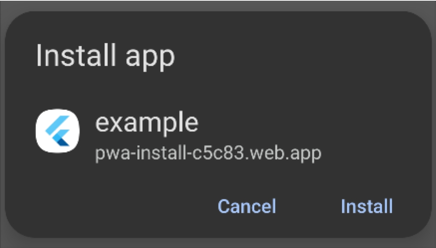
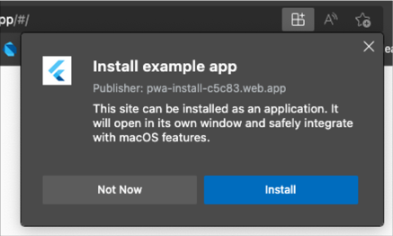

[formatting]: https://docs.github.com/en/get-started/writing-on-github/getting-started-with-writing-and-formatting-on-github/basic-writing-and-formatting-syntax

# PWA Install
A small Flutter package that allows you to prompt mobile web users to install your Flutter app as a [progressive web application](https://en.wikipedia.org/wiki/Progressive_web_app#:~:text=As%20of%202021%2C%20PWA%20features,not%20by%20Firefox%20for%20desktop.) (PWA) on demand.
> The contents of this package are based on this [article](https://web.dev/customize-install/) by Pete LePage (@petele)  

## Out-of-the-Box
As of release 1.20, all [Flutter apps can be installed as PWAs](https://docs.flutter.dev/deployment/web#pwa-support). Combine this with the fact that all Chromium based browsers support PWAs and it becomes clear that designing your Flutter application for a mobile browser can be the most effective way of reaching a large audience.

When a Flutter app is opened in a supported browser, the user will see an install prompt like this:

Mobile Prompt | Web Prompt
:-------------------------:|:-------------------------:
 | 

This is awesome, but there's a caveat. The browser will only show the install prompt to users the first time they open your app. If the user refreshes the page or returns to the app while it's still in their browser history, the prompt will not be shown.

## The PWA Install Package
With this package, you can prompt the user to install your app as a PWA on demand (e.g, on a button click). This package works by capturing the `beforeinstallprompt` event web browsers use to install PWAs. The event is captured when your app is launched and can be called anytime thereafter.

# Setup
## 1. Update index.html
Add the following <script> tag to the body of web/index.html:
```html
<!-- Capture PWA install prompt event -->
<script>
    let deferredPrompt;

    window.addEventListener('beforeinstallprompt', (e) => {
      deferredPrompt = e;
    });

    function promptInstall(){
       deferredPrompt.prompt();
    }

    // Listen for app install event
    window.addEventListener('appinstalled', () => {
      deferredPrompt = null;
      appInstalled();
    });

    // Track how PWA was launched (either from browser or as PWA)
    function getLaunchMode() {
      const isStandalone = window.matchMedia('(display-mode: standalone)').matches;
      if(deferredPrompt) hasPrompt();
      if (document.referrer.startsWith('android-app://')) {
        appLaunchedAsTWA();
      } else if (navigator.standalone || isStandalone) {
        appLaunchedAsPWA();
      } else {
        window.appLaunchedInBrowser();
      }
    }
</script>
```

## 2. Call PWAInstall().setup()
The following method can be called in main.dart before calling runApp(). PWAInstall() is instantiated as a singleton so you can use the class directly.
```dart
Future<void> main() async {

  // Add this
  PWAInstall().setup(installCallback: () {
    debugPrint('APP INSTALLED!');
  });

  runApp(MaterialApp(home: App()));
}
```

## 3. Check if the Install Prompt is enabled
Before calling the `promptInstall_()` method, you can check if the Install Prompt is available using `PWAInstall().installPromptEnabled()`. `installPromptEnabled()` will be true if the app was launched in a browser and the `beforeinstallprompt` event was captured. It doesn't make sense to prompt a PWA install if the app is already running as a PWA.

`promptInstall_()` won't do anything if `installPromptEnabled()` is false so you should check this flag before attempting to call the prompt.  

## 4. Call PWAInstall().promptInstall_()
Finally, call `PWAInstall().promptInstall_()` to show the install prompt.

# Support
<a href="https://buymeacoffee.com/mullr" target="_blank"></a>
<br>
<br>

<a href="https://keepmylightson.xyz/support/joemuller" target="_blank"></a>
<br>
<br>

[:heart: Sponsor on GitHub](https://github.com/sponsors/jtmuller5) 
